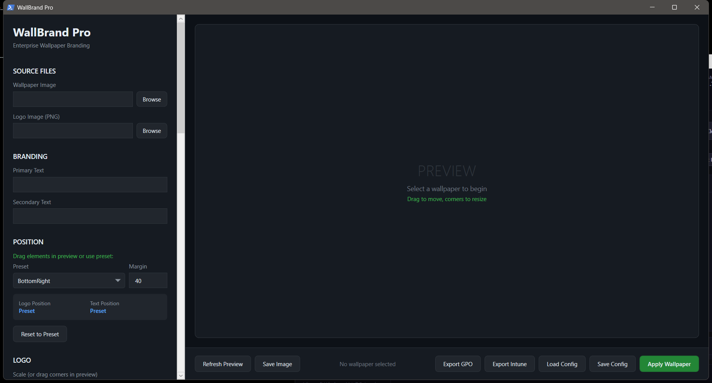

# WallBrand
<<<<<<< HEAD
A wallpaper branding tool with GUI and CLI modes




=======


A wallpaper branding tool with GUI and CLI modes. Add logos, watermarks, and text overlays to wallpapers for corporate branding, digital signage, or personal customization.

## Features

- **GUI Mode** — Visual interface for interactive wallpaper branding with live preview
- **CLI Mode** — Batch process wallpapers from the command line
- **Logo Placement** — Position logos with configurable size, opacity, and corner placement
- **Text Overlays** — Add custom text with font, color, and position controls
- **Batch Processing** — Brand multiple wallpapers at once
- **Dark Theme** — Professional WPF dark-themed interface

## Usage

### GUI Mode
```powershell
.\WallBrandPro.ps1
```

### CLI Mode
```powershell
.\WallBrandPro.ps1 -CLI -InputPath "C:\Wallpapers" -LogoPath "C:\logo.png"
```

## Requirements

- Windows 10/11
- PowerShell 5.1+

## License

MIT License
>>>>>>> 227aee8e4785afb7b11395040d847bf4c7d0429c
